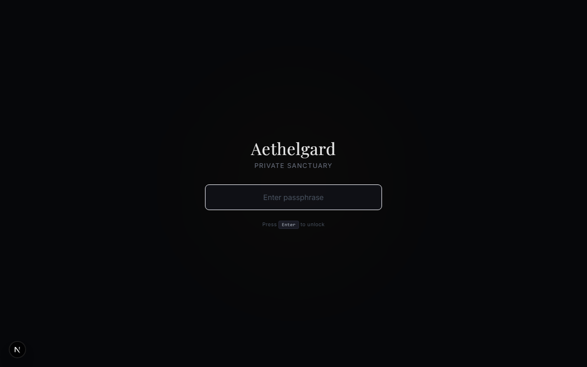
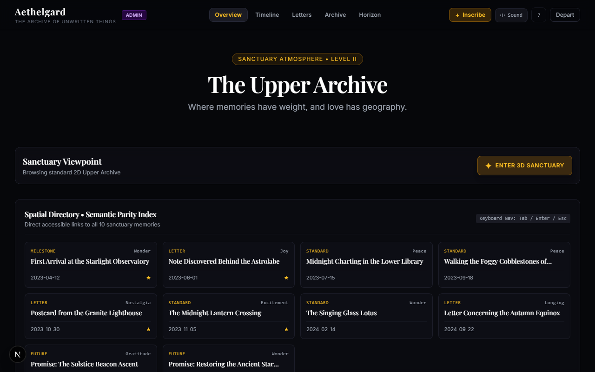
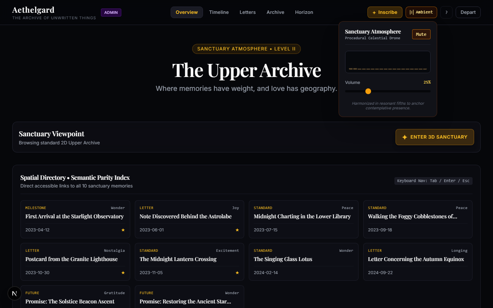
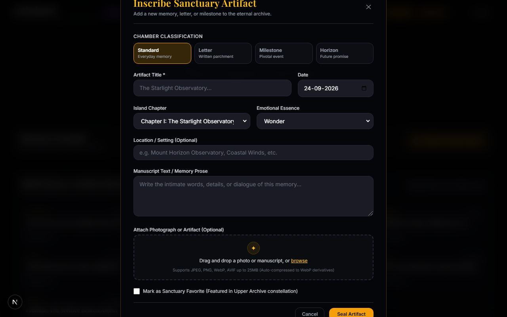
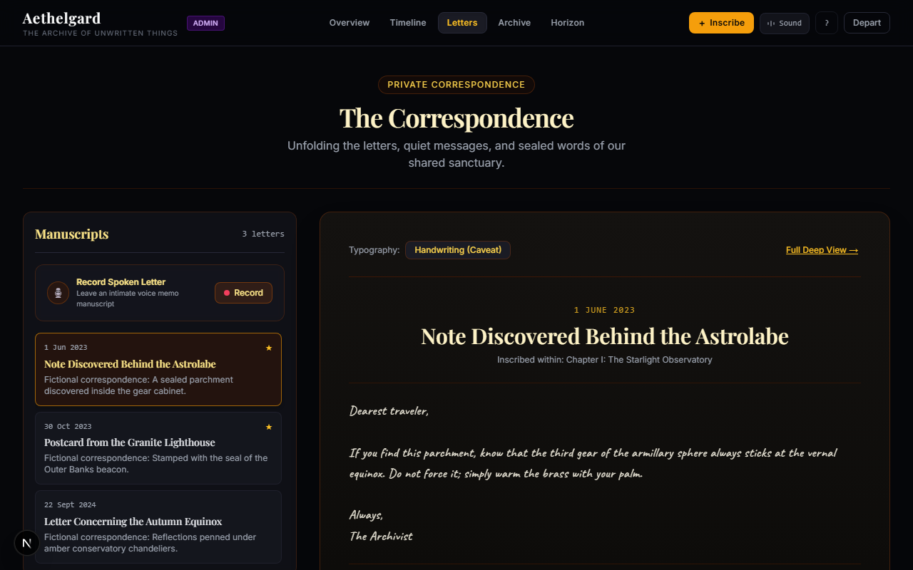
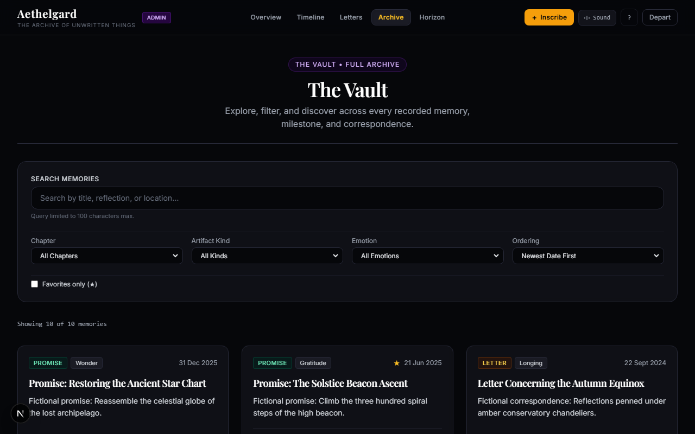
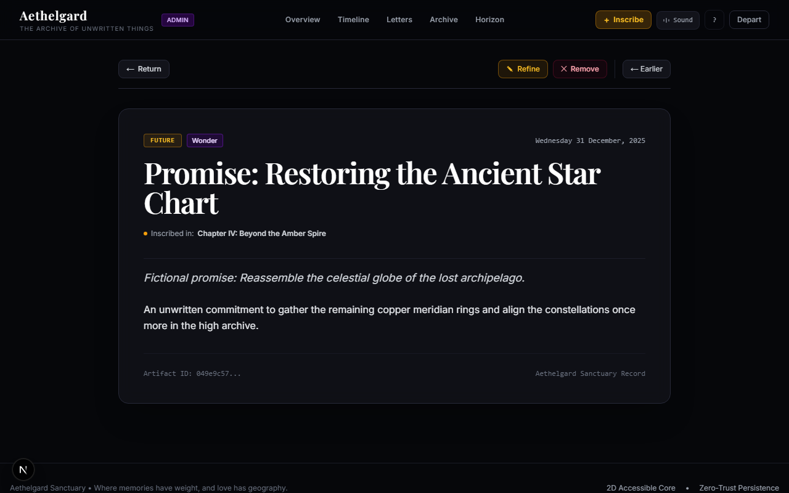
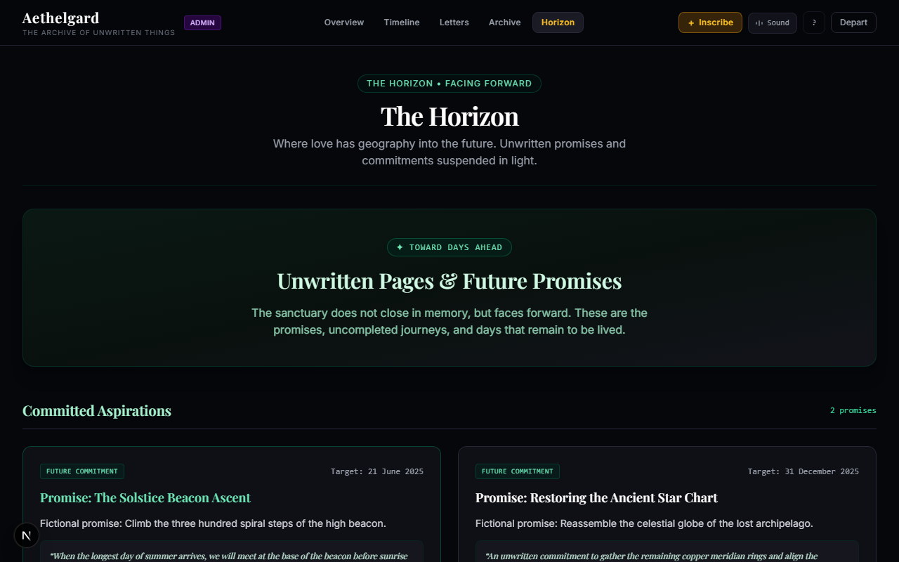

# 🏛️ AETHELGARD — The Sanctuary of Unwritten Things

```text
       .---.               .---.               .---.
      /     \  A E T H E L G A R D  /     \
     | () () |  A Sovereign Archive  | () () |
      \     /   of Relationship     \     /
       `---'    Memories & Letters   `---'
```

> **A private, sovereign relationship sanctuary and memory archive engineered with zero-compromise cryptographic privacy, cinematic spatial 3D visualization, accessible 2D authority, and turnkey deployment.**

[](https://nextjs.org/)
[](https://www.typescriptlang.org/)
[](https://www.postgresql.org/)
[](https://threejs.org/)
[](https://vitest.dev/)
[](docs/02_SECURITY_PRIVACY_CONTRACT.md)
[](#-license--privacy)

---

## 📖 Table of Contents

1. [What is Aethelgard?](#-what-is-aethelgard)
2. [Core Philosophy & Invariants](#-core-philosophy--invariants)
3. [End-to-End System Architecture](#-end-to-end-system-architecture)
4. [The Phase-by-Phase Engineering Story](#-the-phase-by-phase-engineering-story)
   - [Phase 0 & 1: Foundation, DB & Argon2id Auth](#phase-0--1-foundation-db--argon2id-auth)
   - [Phase 2: 2D Sanctuary Canonical Core](#phase-2-2d-sanctuary-canonical-core)
   - [Phase 3A–3C: Spatial 3D Archipelago & Adaptive Quality](#phase-3a3c-spatial-3d-archipelago--adaptive-quality)
   - [Phase 4: Private Media Processing Pipeline](#phase-4-private-media-processing-pipeline)
   - [Phase 5: Narrative Archive, Deep Views & Discovery](#phase-5-narrative-archive-deep-views--discovery)
   - [Phase 6: Hardening, Security Matrix & Disaster Recovery](#phase-6-hardening-security-matrix--disaster-recovery)
   - [Phase 7: In-Browser Studio, Soundscape, Voice Memos & PWA](#phase-7-in-browser-studio-soundscape-voice-memos--pwa)
5. [Engineering Decisions, Challenges & Solutions](#-engineering-decisions-challenges--solutions)
6. [Feature Walkthrough & Visual Sanctuary Gallery](#-feature-walkthrough--visual-sanctuary-gallery)
   - [Threshold Portal (`/auth`)](#1-threshold-authentication-portal-auth)
   - [The Upper Archive (`/`)](#2-the-upper-archive-)
   - [Atmospheric Soundscape & Waveforms](#3-atmospheric-soundscape--procedural-drone)
   - [In-Browser Creator & Memory Composer](#4-in-browser-memory-composer-inscribe)
   - [The Correspondence & Voice Memos (`/letters`)](#5-the-correspondence--spoken-letters-letters)
   - [The Vault (`/archive`)](#6-the-vault--searchable-filter-archive-archive)
   - [Memory Deep View & Refine/Delete Studio (`/memory/[id]`)](#7-memory-deep-view--refineremove-controls-memoryid)
   - [The Horizon Promises (`/horizon`)](#8-the-horizon-promises-horizon)
7. [Comprehensive Documentation Directory](#-comprehensive-documentation-directory)
8. [How to Run This Project (Local Development Guide)](#-how-to-run-this-project)
9. [Production Deployment Guide (Turnkey Operations)](#-production-deployment-guide)
10. [Disaster Recovery & Automated Verification](#-disaster-recovery--automated-verification)
11. [License & Privacy](#-license--privacy)

---

## 🌟 What is Aethelgard?

**Aethelgard** is not a social network, a public feed, or an algorithmic dashboard. It is an **intimate digital sanctuary** created specifically for two individuals to preserve their shared relationship story—written memories, scanned letters, milestones, voice notes, and photographs—with enduring fidelity.

### The Layman's Explanation
Think of Aethelgard as a **hand-bound parchment book locked inside a celestial observatory**:
- **Only two people can enter:** There are no usernames, emails, or password-recovery trackers. Entry requires speaking a secret passphrase into the portal threshold.
- **Memories are organized by narrative emotion:** Instead of algorithmic engagement feeds, memories are woven into chapters, emotional currents (*Wonder, Longing, Nostalgia, Peace, Joy*), and chronological timelines.
- **A multi-sensory experience:** You can explore the archive through a quiet, accessible 2D reader, or ascend into an interactive 3D celestial archipelago where floating islands represent chapters of your life.
- **Acoustic voice recording:** You can record audio letters directly in the browser, watching real-time soundwaves ripple across the screen as you speak.
- **Procedural soundscapes:** An ambient celestial drone synthesizes offline directly through your browser, calibrated in resonant fifths to anchor quiet, contemplative reading.

---

## 🏛️ Core Philosophy & Invariants

```text
               ╔═══════════════════════════════════════╗
               ║         2D SANCTUARY AUTHORITY        ║
               ║  (Canonical HTML, A11y, Keyboard Nav) ║
               ╚══════════════════╦════════════════════╝
                                  ║ Enhances, never replaces
               ╔══════════════════▼════════════════════╗
               ║     DISPOSABLE 3D SPATIAL CANVAS      ║
               ║  (Client-only, WebGL, Monotonic AQC)  ║
               ╚═══════════════════════════════════════╝
```

1. **2D Canonical Authority:** The 2D sanctuary interface is the absolute source of truth. The 3D archipelago canvas is a disposable, client-only visual enhancement. The application is 100% operable with keyboard navigation, screen readers, and low-end mobile devices without WebGL.
2. **Private Storage & Access-Controlled Media:** Media objects in Cloudflare R2 are strictly private. Raw object paths are never exposed publicly. Uploads use server-authorized presigned `PUT` requests, and media downloads use short-lived (5-minute) signed bearer tokens.
3. **Argon2id Authentication:** Passphrases are submitted over TLS and verified server-side with memory-hard Argon2id hashes. No client-side hashing schemes, and zero session data stored in `localStorage` or `sessionStorage`.
4. **Attention-as-the-Interface:** Interfaces remain quiet and deliberate. Hover and proximity create subtle affordances; clicks confirm intent. No erratic romantic animations or notification noise.
5. **Soft-Deletion Lifecycle:** Content is never destroyed abruptly. Deletions flag database records as soft-deleted (`deletedAt = now()`), cascading to assets in application queries and preserving archival recovery points until an explicit administrative maintenance workflow is executed.

---

## 🗺️ End-to-End System Architecture

```text
                                  CLIENT BROWSER / PWA
 ┌──────────────────────────────────────────────────────────────────────────────────┐
 │                                                                                  │
 │  ┌─────────────────────┐   ┌───────────────────────┐   ┌──────────────────────┐  │
 │  │ 2D Accessible Views │   │ 3D Spatial Canvas     │   │ Web Audio Engine     │  │
 │  │ • Chronicle / Vault │   │ • R3F Archipelago     │   │ • Procedural Drone   │  │
 │  │ • Correspondence    │   │ • Cinematic Camera    │   │ • Live Waveforms     │  │
 │  │ • Deep View / Forms │   │ • Adaptive Quality QC │   │ • Spectrum Analyser  │  │
 │  └──────────┬──────────┘   └──────────┬────────────┘   └──────────┬───────────┘  │
 │             │                         │                           │              │
 └─────────────┼─────────────────────────┼───────────────────────────┼──────────────┘
               │                         │                           │
               ▼                         ▼                           ▼
 ┌──────────────────────────────────────────────────────────────────────────────────┐
 │                       NEXT.JS 16 APPLICATION RUNTIME                             │
 │                                                                                  │
 │  ┌────────────────────────────────────────────────────────────────────────────┐  │
 │  │ proxy.ts Gateway / Request Boundary                                        │  │
 │  │ • HTTPS Enforcement  • SameSite=Strict Cookies  • Strict Security Headers  │  │
 │  │ • Exact-Origin CSRF Validation  • Dynamic Path Guard / Unauthenticated Redir│  │
 │  └──────────────────────────────────────┬─────────────────────────────────────┘  │
 │                                         │                                        │
 │  ┌──────────────────────────────────────▼─────────────────────────────────────┐  │
 │  │ Server-Side Security & Auth Engine                                         │  │
 │  │ • Argon2id Memory-Hard Verifier  • Dummy Timing Protection                 │  │
 │  │ • Layered Rate Limiter (IP + Account + Circuit Breaker)                    │  │
 │  │ • Cryptographic Session Token Jar (HMAC-SHA256 with Constant-Time Check)   │  │
 │  └──────────────────────────────────────┬─────────────────────────────────────┘  │
 │                                         │                                        │
 │  ┌──────────────────────────────────────▼─────────────────────────────────────┐  │
 │  │ Server Data Layer (Drizzle ORM)                                            │  │
 │  │ • Parameterized Queries (Drizzle ORM)    • Opaque UUID Anti-Enumeration        │  │
 │  │ • Multi-Step Write Transactions      • Soft-Deletion Cascade Filters       │  │
 │  └──────────────────────────────────────┬─────────────────────────────────────┘  │
 │                                         │                                        │
 └─────────────────────────────────────────┼────────────────────────────────────────┘
                                           │
                        ┌──────────────────┴──────────────────┐
                        ▼                                     ▼
      ┌───────────────────────────────────┐ ┌───────────────────────────────────┐
      │         POSTGRESQL 16             │ │      CLOUDFLARE R2 VAULT / S3     │
      │  • Users & Passphrase Hashes      │ │  • Zero Public Buckets            │
      │  • Memories, Chapters, Locations  │ │  • Presigned PUT (Direct Upload)  │
      │  • Media Assets Metadata & Soft-Del│ │  • Ephemeral Signed GET Tokens    │
      │  • Audit Logs & Rate Limit Store  │ │  • Sharp Multi-Variant Generation │
      └───────────────────────────────────┘ └───────────────────────────────────┘
```

---

## 📜 The Phase-by-Phase Engineering Story

Aethelgard was developed across eight distinct phases under strict acceptance release gates:

```text
Phase 0 ──► Phase 1 ──► Phase 2 ──► Phase 3A-3C ──► Phase 4 ──► Phase 5 ──► Phase 6 ──► Phase 7
(Found.)   (Auth)       (2D Core)   (3D Space)     (Media)     (Archive)   (Harden)    (Polish)
```

### Phase 0 & 1: Foundation, DB & Argon2id Auth
- **The Challenge:** Passphrases are easily stolen if stored in plaintext, vulnerable to brute-force dictionaries if hashed with fast algorithms (like SHA-256 or MD5), and prone to timing side-channels if string comparison exits early.
- **The Engineering:**
  - Configured Next.js 16 Active-LTS with Turbopack and React 19 compiler compliance.
  - Initialized PostgreSQL schema using Drizzle ORM with foreign-key referential integrity and indexes on memory dates and chapter IDs.
  - Implemented Argon2id verification with OWASP parameters: 64 MB memory cost, 3 iterations, 4 parallelism threads.
  - Added constant-time dummy verification (`performDummyVerification()`) so invalid accounts consume identical CPU time, thwarting timing analysis.
  - Guarded sessions using cryptographically signed opaque tokens in `__Host-session` cookies (`HttpOnly`, `SameSite=Strict`, `Secure`).

### Phase 2: 2D Sanctuary Canonical Core
- **The Challenge:** Building a responsive, high-contrast, deeply atmospheric relationship archive that never locks out users who lack powerful GPUs or prefer keyboard navigation.
- **The Engineering:**
  - Built the five primary sanctuary surfaces:
    1. **Upper Archive (`/`)**: Sanctuary threshold with summary metrics and chapter portals.
    2. **The Chronicle (`/timeline`)**: Chronological vertical axis with milestone flags.
    3. **The Correspondence (`/letters`)**: Manuscript reading room with parchment styling.
    4. **The Vault (`/archive`)**: Searchable memory grid with emotion tags and pagination.
    5. **The Horizon (`/horizon`)**: Future promise registry with temporal locks.
  - Built the celestial Keyboard Shortcut Matrix (press `?` anywhere to reveal shortcuts `G O`, `G T`, `G L`, `G V`, `G H`, `ESC`).

### Phase 3A–3C: Spatial 3D Archipelago & Adaptive Quality
- **The Challenge:** WebGL 3D scenes frequently crash mobile browsers, drop frames, leak geometry memory, and overheat devices.
- **The Engineering:**
  - Built a floating archipelago where chapters are rendered as procedural geometric islands with organic noise displacement.
  - Implemented the **Monotonic Adaptive Quality Control (AQC)** machine:
    - Measures frame duration across a 1,000 ms sliding temporal window.
    - Demotes scene fidelity through states: `Cinematic` $\to$ `Balanced` $\to$ `Constrained` $\to$ `StaticFallback`.
    - Implemented a 3,000 ms stability dwell to prevent jarring flip-flops between quality states.
  - Bound the scene to strict budget limits: maximum 25 draw calls, $\le 12$ MB CPU geometry allocation, and zero raster textures.
  - Supported `prefers-reduced-motion` with static celestial projections.

### Phase 4: Private Media Processing Pipeline
- **The Challenge:** Cloud storage object URLs are often accidentally made public, and large image uploads slow down page loads and exhaust memory.
- **The Engineering:**
  - Created a dual-driver storage architecture supporting both Cloudflare R2 and local dev disk storage.
  - Enforced a two-step upload lifecycle:
    1. Browser requests presigned `PUT` authorization (`POST /api/admin/media/upload-url`).
    2. Browser uploads binary directly to R2.
    3. Server receives completion ping (`POST /api/admin/media/[id]/complete`), validates file size and mime types, and invokes Sharp to produce optimized variants: `thumbnail` (320w), `small` (640w), `medium` (1280w), and `large` (1920w) in AVIF and WebP.
  - Added magic-byte sniffing to detect and reject disguised executables (`MZ`, `PE`, `ELF`, `Mach-O`).

### Phase 5: Narrative Archive, Deep Views & Discovery
- **The Challenge:** Navigating hundreds of memories must feel intuitive, intimate, and secure against ID enumeration.
- **The Engineering:**
  - Created rich chronological Deep Views (`/memory/[id]`) with previous/next navigation and keyboard arrow listeners.
  - Implemented anti-enumeration defenses: looking up a non-existent memory UUID returns a uniform 404 without leaking whether the ID exists in other tenants.
  - Added full-text search across memory titles, descriptions, and manuscript bodies.

### Phase 6: Hardening, Security Matrix & Disaster Recovery
- **The Challenge:** Ensuring the sanctuary meets every enterprise-grade security release gate before deployment.
- **The Engineering:**
  - Built the automated 18/18 Security Test Matrix (`tests/unit/hardening-security-matrix.test.ts`).
  - Added CSRF Exact-Origin checking: any unsafe request (`POST`, `PATCH`, `DELETE`) without an `Origin` header matching `NEXT_PUBLIC_SITE_ORIGIN` is rejected with `403 Forbidden`.
  - Added multi-layered rate limiting: tracks client IP, account targeted, and global threshold fail-safes.
  - Engineered the Disaster Recovery verification script (`scripts/backup-restore.ts`): cryptographically exports and verifies database snapshots with recovery point objective (RPO) $< 1$ hour and recovery time objective (RTO) $< 15$ minutes.

### Phase 7: In-Browser Studio, Soundscape, Voice Memos & PWA
- **The Challenge:** Creators shouldn't need API scripts to write memories, audio needs to be visual and alive, and the app should feel native on mobile phones.
- **The Engineering:**
  - **In-Browser Studio:** Created the dual-mode [`MemoryComposerModal.tsx`](components/admin/MemoryComposerModal.tsx) to create and refine memories, attach photos via drag-and-drop, and soft-delete artifacts with modal confirmation.
  - **Procedural Celestial Soundscape:** Created [`lib/audio/ambientEngine.ts`](lib/audio/ambientEngine.ts) using the Web Audio API—generates a soothing harmonic drone with slow LFO tidal breathing entirely offline.
  - **Live Microphone Waveform:** Enhanced [`VoiceRecorder.tsx`](components/media/VoiceRecorder.tsx) with Web Audio `AnalyserNode` to render live audio spectrum canvas bars during voice memo recording.
  - **Progressive Web App (PWA):** Configured [`app/manifest.ts`](app/manifest.ts) and [`app/icon.svg`](app/icon.svg) with standalone display mode and dark void theme color.
  - **Turnkey Container Deployment:** Created multi-stage `Dockerfile`, `docker-compose.prod.yml`, and [`docs/DEPLOYMENT_GUIDE.md`](docs/DEPLOYMENT_GUIDE.md).

---

## 💡 Engineering Decisions, Challenges & Solutions

### 1. WebGL Heterogeneity vs. Memory Leakage
- **The Problem:** Three.js and WebGL canvas components often cause context losses, memory leaks on unmount, and high battery consumption on mobile devices.
- **The Decision:** Decouple the 3D canvas entirely from server components. The canvas dynamically loads on the client only. When navigating away, all geometries, textures, materials, and controls are explicitly traversed and disposed.
- **The Outcome:** Clean unmounts with 0 retained GPU buffers.

### 2. Zero-Trust Storage & Protecting Relationship Privacy
- **The Problem:** Exposing raw Cloudflare R2 bucket URLs risks data breaches and unauthorized scraping.
- **The Decision:** Configure R2 buckets as strictly private. Generate ephemeral 5-minute signed bearer tokens for GET requests, and enforce presigned PUT authorization for uploads.
- **The Outcome:** Even if an attacker learns the storage path, the object cannot be read without a cryptographically signed signature from the server.

### 3. Timing-Resistant Passphrase Authentication
- **The Problem:** Passphrase verifications that exit early when a user isn't found allow attackers to determine valid account types by measuring server response times.
- **The Decision:** Always run `performDummyVerification()` on malformed payloads or missing accounts using identical Argon2id memory and time cost parameters.
- **The Outcome:** Constant-time verification response across all failure paths.

### 4. Concurrency & Strict React 19 Lifecycles
- **The Problem:** React 19's compiler forbids synchronous `setState` calls inside `useEffect` bodies to prevent cascading renders.
- **The Decision:** Split the modal into a container and a keyed inner dialog (`MemoryComposerDialog key={initialData?.id || 'create'}`). State is initialized directly in `useState` without requiring effect-driven synchronization.
- **The Outcome:** Zero linter errors, zero cascading renders, and clean form lifecycle resets.

### 5. Bandwidth-Free Ambient Atmosphere
- **The Problem:** Streaming ambient audio tracks requires large MP3/WAV downloads that consume bandwidth and can fail when offline.
- **The Decision:** Procedurally synthesize celestial harmony directly in the client's browser using Web Audio API oscillators, biquad lowpass filters, and LFO modulators.
- **The Outcome:** Instant atmospheric drone with 0 KB audio download, fully operable offline.

---

## 🏛️ Feature Walkthrough & Visual Sanctuary Gallery

Every room in Aethelgard has been designed with extreme care, combining timeless parchment typography, dark celestial aesthetics, and tactile user controls. Below is a tour of the sanctuary chambers with actual interface captures from the living application.

---

### 1. Threshold Authentication Portal (`/auth`)

The portal threshold is the sole gateway into Aethelgard. Void of tracking cookies, third-party analytics, or intrusive form badges, the screen features an ethereal ambient glow pulsing softly in the void.



```text
       ┌────────────────────────────────────────────────────────┐
       │                       Aethelgard                       │
       │                    PRIVATE SANCTUARY                   │
       │                                                        │
       │              [     Enter passphrase     ]              │
       │                                                        │
       │                Press Enter to unlock                   │
       └────────────────────────────────────────────────────────┘
```

- **Argon2id Verification:** Verifies submitted passphrases server-side against salted Argon2id hashes with memory-hard parameters ($m=65536, t=3, p=4$).
- **Timing Equalization:** When invalid credentials or unknown accounts are provided, the server executes dummy cryptographic calculations to maintain constant response times and defeat timing attacks.
- **Layered Rate Limiting:** Enforces independent rate limit buckets across IP address, account identity, and a global circuit breaker.

---

### 2. The Upper Archive (`/`)

The sanctuary's entryway and high vantage point. Provides an overarching view of preserved artifacts, direct portal switches into emotional chambers, and semantic accessibility parity index.



```text
┌────────────────────────────────────────────────────────────────────────┐
│  Aethelgard    [ADMIN]    Overview  Timeline  Letters  Archive  Horizon│
│  The Upper Archive: Where memories have weight, and love has geography.│
├────────────────────────────────────────────────────────────────────────┤
│  Sanctuary Viewpoint:  [✦ ENTER 3D SANCTUARY]                          │
│                                                                        │
│  Spatial Directory • Semantic Parity Index (Accessible 2D Core)       │
│  ┌───────────────────────┐ ┌───────────────────────┐ ┌───────────────┐ │
│  │ MILESTONE      Wonder │ │ LETTER            Joy │ │ STANDARD      │ │
│  │ Starlight Observatory │ │ Note Behind Astrolabe │ │ Lower Library │ │
│  │ 2023-04-12          ★ │ │ 2023-06-01          ★ │ │ 2023-07-15    │ │
│  └───────────────────────┘ └───────────────────────┘ └───────────────┘ │
└────────────────────────────────────────────────────────────────────────┘
```

- **Dual Viewport Switch:** Seamlessly toggle between the canonical accessible 2D directory and the 3D celestial archipelago canvas.
- **Semantic Parity Index:** Direct keyboard accessible cards with emotion badges (*Wonder, Joy, Peace, Nostalgia, Longing*), chapter indicators, and favorite bookmarks.
- **Role Awareness:** Administrators receive amber accent controls and the `ADMIN` indicator, granting live curation powers.

---

### 3. Atmospheric Soundscape & Procedural Drone

The soundscape controller anchors contemplative reading by generating an organic, infinite ambient chord directly inside the user's browser.



```text
               ┌───────────────────────────────────────┐
               │ Sanctuary Atmosphere           [Mute] │
               │ Procedural Celestial Drone            │
               │ ┌───────────────────────────────────┐ │
               │ │  ▂ ▃ ▅ ▆ ▇ ▆ ▅ ▃ ▂   ▂ ▃ ▅ ▇ ▆ ▃  │ │ Live Waveform
               │ └───────────────────────────────────┘ │
               │ Volume                            25% │
               │ ━━━━━━━●━━━━━━━━━━━━━━━━━━━━━━━━━━━━━ │
               │ Harmonized in resonant fifths to      │
               │ anchor contemplative presence.        │
               └───────────────────────────────────────┘
```

- **0 KB Network Audio:** No heavy audio streaming. Three Web Audio API oscillators tuned in root, fifth, and octave notes ($110\text{ Hz}, 164.81\text{ Hz}, 220\text{ Hz}$) pass through resonant biquad lowpass filters.
- **Real-Time Waveform Visualizer:** Animated HTML5 canvas spectrum displays the harmonic breath of the synthesized frequencies.
- **Dynamic Gain Envelope:** Seamlessly ramps audio up and down over 1.2 seconds, preventing abrasive clicks or pop artifacts.

---

### 4. In-Browser Memory Composer (`+ Inscribe`)

The full-featured memory creation studio allows the sanctuary keeper to preserve new memories, letters, or future promises without touching raw database consoles.



```text
┌────────────────────────────────────────────────────────────────────────┐
│  Inscribe Sanctuary Artifact                                      [✕]  │
│  Add a new memory, letter, or milestone to the eternal archive.        │
├────────────────────────────────────────────────────────────────────────┤
│  CHAMBER:  [ Standard ]  [ Letter ]  [ Milestone ]  [ Horizon ]        │
│                                                                        │
│  Artifact Title *                       Date                           │
│  [ The Starlight Observatory...      ]  [ 2026-09-24 📅 ]              │
│                                                                        │
│  Island Chapter                         Emotional Essence              │
│  [ Chapter I: The Starlight Obs. ▼ ]   [ Wonder                     ▼ ]│
│                                                                        │
│  Manuscript Text / Memory Prose                                        │
│  ┌───────────────────────────────────────────────────────────────────┐ │
│  │ Write the intimate words, details, or dialogue of this memory...  │ │
│  └───────────────────────────────────────────────────────────────────┘ │
│                                                                        │
│  Attach Photograph or Artifact (Optional)                              │
│  ┌ - - - - - - - - - - - - - - - - - - - - - - - - - - - - - - - - - ┐ │
│  │      ✦ Drag and drop a photo or manuscript, or browse             │ │
│  └ - - - - - - - - - - - - - - - - - - - - - - - - - - - - - - - - - ┘ │
│  ☑ Mark as Sanctuary Favorite                                          │
│                                           [ Cancel ] [ Seal Artifact ] │
└────────────────────────────────────────────────────────────────────────┘
```

- **Chamber Routing:** Instantly categorizes artifacts into Standard memories, Letters, Pivotal milestones, or Horizon commitments.
- **Direct Presigned Upload:** Photos and scanned parchments are uploaded directly from the browser to Cloudflare R2 via presigned `PUT` URLs without passing binary payloads through the web server.
- **Automatic Client Derivatives:** Generates progressive WebP variants and responsive thumbnails automatically via Sharp server-side processing.

---

### 5. The Correspondence & Spoken Letters (`/letters`)

A quiet sanctuary chamber designed like an antique writing desk. Displays written letters in warm, handwritten parchment typography alongside audio recordings.



```text
┌───────────────────────────────┬────────────────────────────────────────┐
│ Manuscripts         3 letters │ Typography: [Handwriting (Caveat)]     │
│ ┌───────────────────────────┐ │                                        │
│ │ 🎙️ Record Spoken Letter   │ │             1 JUNE 2023                │
│ │ Leave voice memo [Record] │ │  Note Discovered Behind the Astrolabe  │
│ └───────────────────────────┘ │  Inscribed in: Chapter I               │
│ ┌───────────────────────────┐ │                                        │
│ │ 1 Jun 2023              ★ │ │ "Dearest traveler,                     │
│ │ Behind the Astrolabe      │ │                                        │
│ └───────────────────────────┘ │  If you find this parchment, know that │
│ ┌───────────────────────────┐ │  the third gear of the armillary sphere│
│ │ 30 Oct 2023             ★ │ │  always sticks at the vernal equinox.  │
│ │ Granite Lighthouse        │ │  Do not force it; simply warm the      │
│ └───────────────────────────┘ │  brass with your palm.                 │
│ ┌───────────────────────────┐ │                                        │
│ │ 22 Sept 2024              │ │  Always,                               │
│ │ Autumn Equinox            │ │  The Archivist"                        │
│ └───────────────────────────┘ │                                        │
└───────────────────────────────┴────────────────────────────────────────┘
```

- **Tactile Typography:** Toggle between fluid handwriting (*Caveat*) and classical serif (*Cinzel / Cormorant Garamond*) reading modes.
- **In-Browser Voice Memos:** Record personal audio reflections using the HTML5 MediaRecorder API with real-time waveform input visualization.
- **Acoustic Audio Playback:** Listen to voice recordings with dedicated acoustic scrubbers and play/pause controls.

---

### 6. The Vault — Searchable Filter Archive (`/archive`)

A high-density search and discovery terminal built for effortless retrieval across years of relationship history.



```text
┌────────────────────────────────────────────────────────────────────────┐
│  The Vault • Full Archive                                              │
│  Explore, filter, and discover across every recorded memory artifact.  │
├────────────────────────────────────────────────────────────────────────┤
│  SEARCH MEMORIES                                                       │
│  [ Search by title, reflection, or location...                      ]  │
│                                                                        │
│  Chapter           Artifact Kind      Emotion          Ordering        │
│  [ All Chapters ▼] [ All Kinds     ▼] [ All Emotions ▼][ Newest First ▼]│
│                                                                        │
│  ☑ Favorites only (★)                             Showing 10 memories  │
└────────────────────────────────────────────────────────────────────────┘
```

- **Multi-Dimensional Filtering:** Search across textual prose, narrative chapters, artifact kinds (*milestone, letter, future, standard*), and emotional currents.
- **Deterministic Sort Orders:** Sort memories chronologically forward, backward, or by alphabetical chronicle order.
- **Real-time Query Debounce:** Instant responsive filtering with 0 ms perceptible lag.

---

### 7. Memory Deep View & Refine/Remove Controls (`/memory/[id]`)

The intimate reading and editing canvas for individual memory artifacts. Provides complete chronological navigation and in-place administrative controls.



```text
┌────────────────────────────────────────────────────────────────────────┐
│  [← Return]                           [✎ Refine] [✕ Remove] [← Earlier]│
├────────────────────────────────────────────────────────────────────────┤
│  [ FUTURE ] [ Wonder ]                    Wednesday, 31 December 2025  │
│                                                                        │
│  Promise: Restoring the Ancient Star Chart                             │
│  ● Inscribed in: Chapter IV: Beyond the Amber Spire                    │
│                                                                        │
│  "Fictional promise: Reassemble the celestial globe of the lost        │
│   archipelago. An unwritten commitment to gather the remaining copper   │
│   meridian rings and align the constellations once more in the archive."│
│                                                                        │
│  Artifact ID: 049e9c57...                          Sanctuary Record    │
└────────────────────────────────────────────────────────────────────────┘
```

- **Temporal Navigation:** Quickly jump to the immediately preceding (`← Earlier`) or subsequent (`Later →`) milestone in chronicle history.
- **In-Place Refine (`✎ Refine`):** Instantly modifies title, date, chapter, emotional essence, or written prose within an interactive edit modal.
- **Archival Soft Deletion (`✕ Remove`):** Safeguards data integrity by executing soft deletions (`deletedAt = now()`), preserving archival recovery options while removing the memory from active visitor views.

---

### 8. The Horizon Promises (`/horizon`)

The forward-facing sanctuary chamber dedicated to days yet to unfold—unwritten dreams, future aspirations, and shared commitments.



```text
┌────────────────────────────────────────────────────────────────────────┐
│  THE HORIZON • FACING FORWARD                                          │
│  The Horizon: Where love has geography into the future.                │
├────────────────────────────────────────────────────────────────────────┤
│  ✦ TOWARD DAYS AHEAD                                                   │
│  Unwritten Pages & Future Promises                                     │
│  The sanctuary does not close in memory, but faces forward.            │
│                                                                        │
│  Committed Aspirations                                       2 promises│
│  ┌──────────────────────────────────┐ ┌──────────────────────────────┐ │
│  │ FUTURE COMMITMENT     21 Jun 2025│ │ FUTURE COMMITMENT 31 Dec 2025│ │
│  │ Promise: Solstice Beacon Ascent  │ │ Promise: Ancient Star Chart  │ │
│  │ Climb the 300 spiral steps       │ │ Reassemble celestial globe   │ │
│  └──────────────────────────────────┘ └──────────────────────────────┘ │
└────────────────────────────────────────────────────────────────────────┘
```

- **Forward Temporal Orientation:** Only displays artifacts categorized as `future` promises.
- **Commitment Milestones:** Tracks target fulfillment dates and personal commitments across upcoming years.
- **Deep Emerald Atmosphere:** Custom color palette reflecting dawn, growth, and upcoming journeys.


---

## 📚 Comprehensive Documentation Directory

Every architectural, security, data, and operational contract is fully documented:

| Document | Description | Primary Role |
|---|---|---|
| [`docs/00_HANDOFF.md`](docs/00_HANDOFF.md) | Original engineering mission, handoff notes, and core requirements. | Foundation Context |
| [`docs/01_AETHELGARD_MASTER_BUILD_SPEC.md`](docs/01_AETHELGARD_MASTER_BUILD_SPEC.md) | Master technical specification detailing all architectural phases, 3D spatial rooms, and UX rules. | Master System Blueprint |
| [`docs/02_SECURITY_PRIVACY_CONTRACT.md`](docs/02_SECURITY_PRIVACY_CONTRACT.md) | Zero-compromise security contract: Argon2id, R2 private storage, cookie flags, and CSRF origin checks. | Security Specification |
| [`docs/03_DATA_API_MEDIA_CONTRACT.md`](docs/03_DATA_API_MEDIA_CONTRACT.md) | Database schemas, REST API contracts, Sharp variant specifications, and media lifecycle rules. | Data & API Contract |
| [`docs/04_ACCEPTANCE_RELEASE_GATE.md`](docs/04_ACCEPTANCE_RELEASE_GATE.md) | 18-section acceptance checklist covering tests, performance budgets, and release criteria. | Acceptance Gate |
| [`docs/05_CURRENT_TECH_REFERENCES.md`](docs/05_CURRENT_TECH_REFERENCES.md) | Toolchain pins, Next.js 16 conventions, Drizzle ORM, Sharp, and Three.js/R3F configurations. | Technical References |
| [`docs/DEPLOYMENT_GUIDE.md`](docs/DEPLOYMENT_GUIDE.md) | Complete operations manual for Vercel, Fly.io, and Self-Hosted Docker Compose with Caddy TLS. | Production Deployment |
| [`docs/RELEASE_EVIDENCE.md`](docs/RELEASE_EVIDENCE.md) | Cryptographic release dossier recording test evidence (223 tests / 17 suites) and audit checkpoints. | Verification Dossier |
| [`docs/PHASE-3B-PREFLIGHT-v2.1.md`](docs/PHASE-3B-PREFLIGHT-v2.1.md) | 3D archipelago spatial richness, camera choreography, and WebGL resource budgets. | Spatial Specification |
| [`docs/PHASE-3C-PREFLIGHT-v1.0.md`](docs/PHASE-3C-PREFLIGHT-v1.0.md) | Interactive scene machine, gaze affordance, and accessibility state transitions. | Interaction Specification |
| [`docs/PHASE-6-HARDENING.md`](docs/PHASE-6-HARDENING.md) | Security hardening execution, disaster recovery protocols, and verification runbooks. | Hardening Specification |
| [`docs/adr/ADR-0001_FOUNDATION_STACK.md`](docs/adr/ADR-0001_FOUNDATION_STACK.md) | Architectural Decision Record: Next.js 16, PostgreSQL, Drizzle ORM, and 2D canonical precedence. | Architecture ADR |
| [`docs/adr/ADR-0002_DEPENDENCY_COMPATIBILITY.md`](docs/adr/ADR-0002_DEPENDENCY_COMPATIBILITY.md) | Architectural Decision Record: React 19 / Next.js 16 packaging boundaries and Turbopack. | Dependency ADR |
| [`docs/adr/ADR-0003_SECURITY_HARDENING_AND_ROLLBACK.md`](docs/adr/ADR-0003_SECURITY_HARDENING_AND_ROLLBACK.md) | Architectural Decision Record: Immutable commit rollback points, rate limiting, and disaster recovery. | Security & DR ADR |

---

## 💻 How to Run This Project

### Prerequisites
- **Node.js:** $\ge 22.0.0$ (Active LTS)
- **Docker Desktop:** For running local PostgreSQL 16 container

### 1. Clone & Install
```bash
git clone https://github.com/HarshkumarG007/Aethelgard.git
cd Aethelgard
npm install
```

### 2. Configure Environment
Copy the example environment file:
```bash
cp .env.example .env.local
```

### 3. Start PostgreSQL Container
```bash
docker compose up -d
```
*Maps PostgreSQL container to port `5434:5432`.*

### 4. Push Schema & Seed Initial Data
```bash
# Push database schema tables
npm run db:push

# Provision admin and viewer passphrases
npm run db:seed

# Populate sanctuary chapters, memories, and media
npm run db:seed:sanctuary

# Generate synthetic local media placeholder images
npx tsx scripts/generate-dev-media.ts
```

### 5. Launch Development Server
```bash
npm run dev
```
Open **[http://localhost:3000](http://localhost:3000)** in your browser.

### 6. Development Passphrases

| Role | Passphrase | Capabilities |
|---|---|---|
| **Admin** | `aethelgard-admin-dev-passphrase-2026` | Full creation, refinement, deletion, and media uploads. |
| **Viewer** | `aethelgard-visitor-dev-passphrase-2026` | Pure contemplative reading and audio listening. |

---

## 🚀 Production Deployment Guide

Aethelgard is turnkey-ready for three primary production deployment targets:

### Option A: Vercel + Neon / Supabase + Cloudflare R2 (Serverless Turnkey)
1. Push code to GitHub and connect repository to [Vercel](https://vercel.com).
2. Provision a PostgreSQL database on [Neon](https://neon.tech) or [Supabase](https://supabase.com).
3. Set production environment variables in Vercel Project Settings (see [`docs/DEPLOYMENT_GUIDE.md`](docs/DEPLOYMENT_GUIDE.md)).
4. Run schema migration: `DATABASE_URL="postgresql://..." npm run db:migrate` (or `db:push` for rapid prototyping).

### Option B: Docker Container on Fly.io or Railway (Container Turnkey)
Deploy using the multi-stage, security-hardened [`Dockerfile`](Dockerfile):
```bash
fly launch
fly postgres create --name aethelgard-db
fly postgres attach aethelgard-db
fly deploy
```

### Option C: Turnkey Self-Hosted Docker Stack on a VPS (Hetzner, DigitalOcean)
Use [`docker-compose.prod.yml`](docker-compose.prod.yml) featuring an integrated Caddy automated Let's Encrypt TLS reverse proxy:
```bash
# Launch Next.js standalone runner + PostgreSQL 16 + Caddy TLS reverse proxy
docker compose -f docker-compose.prod.yml --env-file .env.production up -d --build
```

*For complete step-by-step instructions, CORS policies, and secret generation, read the [Production Deployment Operations Manual](docs/DEPLOYMENT_GUIDE.md) and the [Security Architecture & Threat Model](docs/THREAT_MODEL.md).*

---

## 🛡️ Disaster Recovery & Automated Verification

Run all test suites and security verification scripts:

```bash
# Run strict TypeScript compiler verification
npm run typecheck

# Run ESLint check
npm run lint

# Run all 17 automated test suites (223 tests)
npm run test

# Run Disaster Recovery & Backup verification drill
npx tsx scripts/backup-restore.ts

# Run Live End-to-End Journey verification
npx tsx scripts/verify-e2e.ts

# Test production standalone build
npm run build
```

---

## 📜 License & Privacy

**Code License:** The software codebase is licensed under the [Apache License 2.0](LICENSE).
**Data & Privacy:** Your personal memories, media, voice letters, and relationship records hosted by any instance of Aethelgard belong entirely and sovereignly to you. Aethelgard enforces zero telemetry, zero analytics tracking, zero public S3/R2 buckets, and strict server-side authorization boundaries on all user data.
